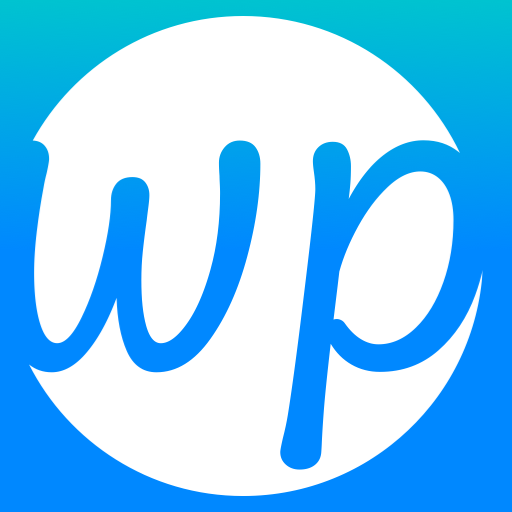
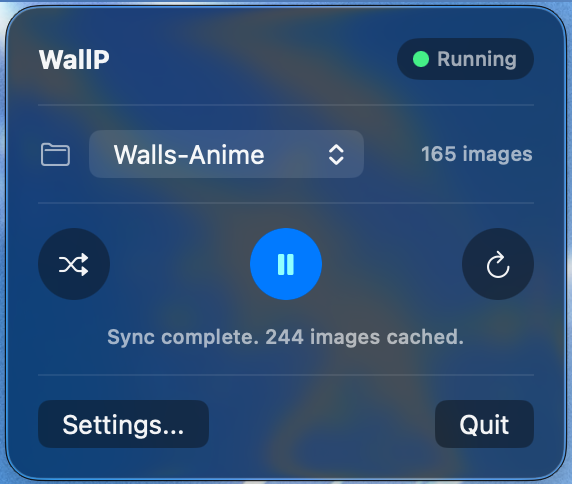
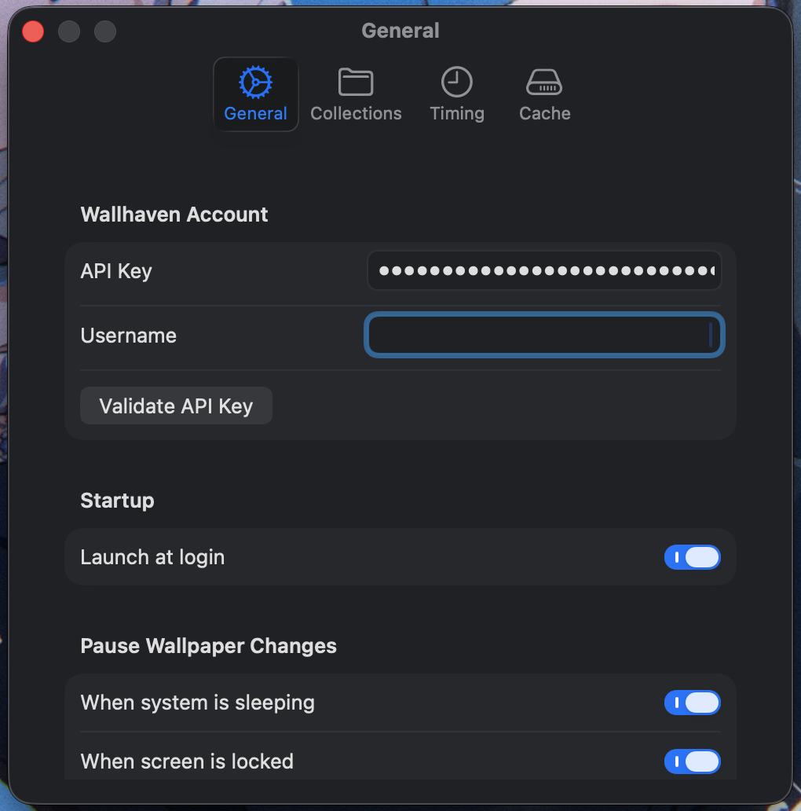
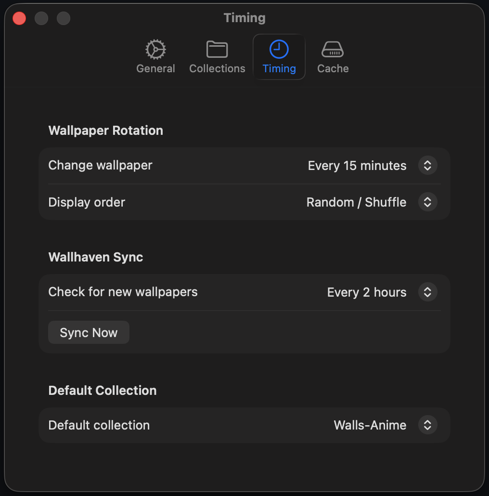
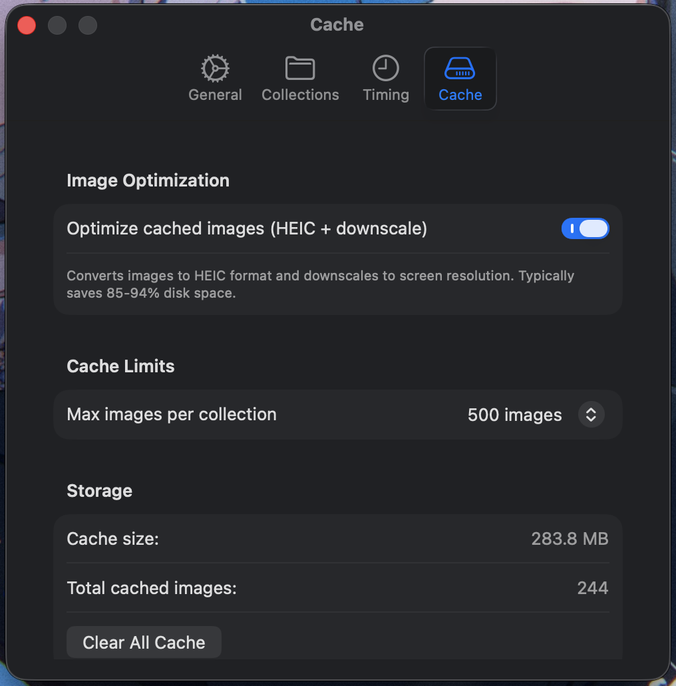

<p align="center">
  
</p>

<h1 align="center">WallP</h1>

<p align="center">
  A macOS menu bar app that automatically rotates your desktop wallpaper using your <a href="https://wallhaven.cc">Wallhaven</a> collections.
</p>

---

## Requirements

- macOS 26 (Tahoe) or later
- A [Wallhaven](https://wallhaven.cc) account with an API key

## Features

- Fetches wallpapers from your Wallhaven collections and caches them locally
- Automatically rotates wallpapers on a configurable schedule (5 min – 4 hr)
- Supports multiple monitors — different random wallpaper per screen
- Multiple collections with a default collection picker
- Per-Focus-mode collection switching via macOS Focus Filters
- Syncs new wallpapers from Wallhaven on a configurable schedule
- Image optimization: converts to HEIC and downscales to your screen resolution
- Pauses rotation when system sleeps, screen locks, or display turns off
- Launch at login support
- macOS 26 Liquid Glass UI

## Screenshots

<p align="center">
  
</p>

<p align="center">
  
  &nbsp;&nbsp;
  
</p>

<p align="center">
  
</p>

## Installation

1. Download `WallP.dmg` from the [Releases](../../releases) page
2. Open the DMG and drag **WallP** to your `/Applications` folder
3. Right-click the app and select **Open** (required on first launch since the app is not notarized)
4. WallP appears in your menu bar

## Setup

1. Click the WallP icon in the menu bar
2. Open **Settings...**
3. Under **General**, enter your Wallhaven **API Key** and **Username**
   - Get your API key at [wallhaven.cc/settings/account](https://wallhaven.cc/settings/account)
   - Click **Validate API Key** to confirm it works
4. Go to the **Collections** tab and click **Add from Wallhaven**
5. Select a collection from the dropdown and click **Add**
6. The app will sync and start rotating wallpapers automatically

## Usage

### Menu Bar Popover

| Button | Action |
|---|---|
| Shuffle (left) | Pick a new random wallpaper immediately |
| Play / Pause (center) | Pause or resume automatic rotation |
| Sync (right) | Manually sync latest wallpapers from Wallhaven |

The collection dropdown lets you switch collections on the fly — the wallpaper changes immediately.

### Settings

| Tab | Options |
|---|---|
| **General** | API key, username, launch at login, pause conditions, Focus mode |
| **Collections** | Add/remove Wallhaven collections, set default collection |
| **Timing** | Rotation interval, display order (random/name/date), sync interval |
| **Cache** | Image optimization toggle, max images per collection, clear cache |

### Focus Mode Integration

Assign different collections to different Focus modes (Work, Personal, Sleep, etc.):

1. Open **System Settings > Focus**
2. Select a Focus mode
3. Go to **Filters > Add Filter > WallP**
4. Choose a collection for that Focus mode

WallP will automatically switch collections when you activate that Focus mode.

## Building from Source

Requires Xcode 26.3 or later.

```bash
git clone https://github.com/yogiee/WallP.git
cd WallP
open WallP.xcodeproj
```

Build and run with **Cmd+R**, or build a Release binary:

```bash
xcodebuild -scheme WallP -configuration Release build
```

## License

MIT
